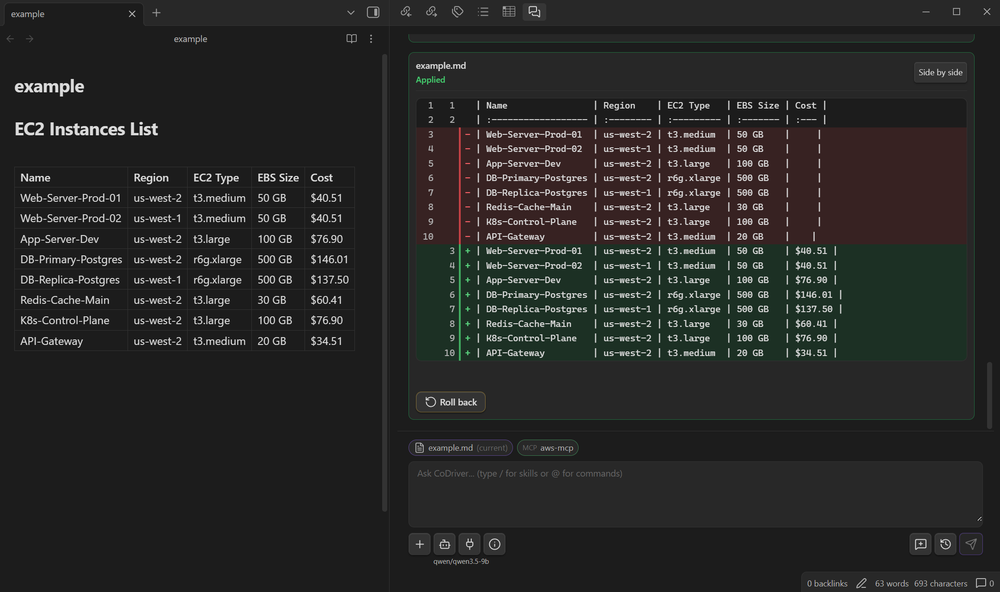

# CoDriver

Chat with your Obsidian vault without leaving Obsidian.

CoDriver puts your preferred language models in the right sidebar. Create, improve, and organize notes without giving up control over changes.

## What you can do

- Create notes, append content, update text and properties, move files, and send notes to trash.
- Review note patches as a unified diff or side-by-side comparison, then accept, reject, or roll back an applied patch.
- Connect OpenAI-compatible providers, Gemini, or Anthropic and switch models from the chat composer.
- See every vault tool call and control automatic execution per tool.

## Add your first provider

1. Open **Settings -> CoDriver Settings -> Providers**.
2. Click **Add model** under **LLM providers**.
3. Choose the **Provider type**, enter a name, and check the endpoint.
4. Select or create an **API key** entry. Keys stay in Obsidian secret storage.
5. Click **Test connection** to load available models.
6. Choose the **Default model** and click **Save**.

| Provider type | Endpoint | Notes |
| --- | --- | --- |
| OpenAI | Your provider's OpenAI-compatible `/v1` endpoint | Hosted services and local servers are supported. |
| Gemini | `https://generativelanguage.googleapis.com` | The API version defaults to `v1beta`. |
| Anthropic | `https://api.anthropic.com` | Uses the native Claude Messages API. The endpoint is fixed. |

If the test fails, check the endpoint, API key, account access, and local server status. OpenAI-compatible endpoints commonly end in `/v1`.

## Work with your vault

CoDriver works with your vault through its built-in MCP server. Its configurable tools use the native Obsidian API to search, read, create, update, move, and trash vault files.

*After applying a patch, **Roll back** can restore the previous version while its review state remains in the live session. If the note has changed again, CoDriver refuses an unsafe rollback.*

## More features

- **Attachments and audio:** Add supported files to the conversation and transcribe audio.
- **Skills and commands:** Reuse instructions, local references, and prompt templates.
- **MCP:** Connect external HTTP tools, or stdio tools on supported desktop runtimes.
- **Local sessions:** Keep chat history on your device without saving attachment contents, transcripts, or tool results in it.

## Safety and privacy

- Active-note content is never injected automatically.
- Provider keys use Obsidian secret storage.
- Proposed edits are revalidated before application or rollback.
- MCP arguments are validated locally against each tool's discovered schema without coercion; invalid calls are returned to the model and are never executed.
- Diagnostics exclude note content, prompts, provider responses, tool data, transcripts, and secrets.

Your selected provider still receives the context required for the current request. Review that provider's privacy and retention terms before sending sensitive material.

## Installation

1. Open the [latest CoDriver release](https://github.com/NikChallenger/codriver/releases/latest).
2. Download [`main.js`](https://github.com/NikChallenger/codriver/releases/latest/download/main.js), [`manifest.json`](https://github.com/NikChallenger/codriver/releases/latest/download/manifest.json), and [`styles.css`](https://github.com/NikChallenger/codriver/releases/latest/download/styles.css).
3. Copy them into `.obsidian/plugins/codriver/` inside your vault.
4. Open **Settings -> Community plugins**, turn off **Restricted mode**, and enable **CoDriver**.

To update CoDriver, download the latest versions of the same three files, replace the installed copies, and reload Obsidian.

The public GitHub repository contains the reviewed source snapshot and generated release artifacts for each public version. Its root `build.mjs` rebuilds `main.js` without registry dependencies, and the committed bundle must match that build exactly. Private release-control instructions, internal automation, and tests are not included in the public snapshot.

GitHub's automatically generated source archives are source snapshots, not installable CoDriver packages. Install CoDriver using the three assets attached to a matching GitHub release.

## Requirements

- Obsidian `1.5.0` or newer.
- A supported provider account or server.
- Desktop Obsidian with Node subprocess support for stdio MCP servers.

CoDriver works inside Obsidian. It is not a background automation agent or a CLI coding tool.

> [!WARNING]
> CoDriver is still evolving. For peace of mind, try it in a test vault first and keep regular backups of important notes.

## License

CoDriver is available under the [MIT License](LICENSE). See [Third-Party Notices](THIRD_PARTY_NOTICES.md) for vendored dependencies and their licenses.
