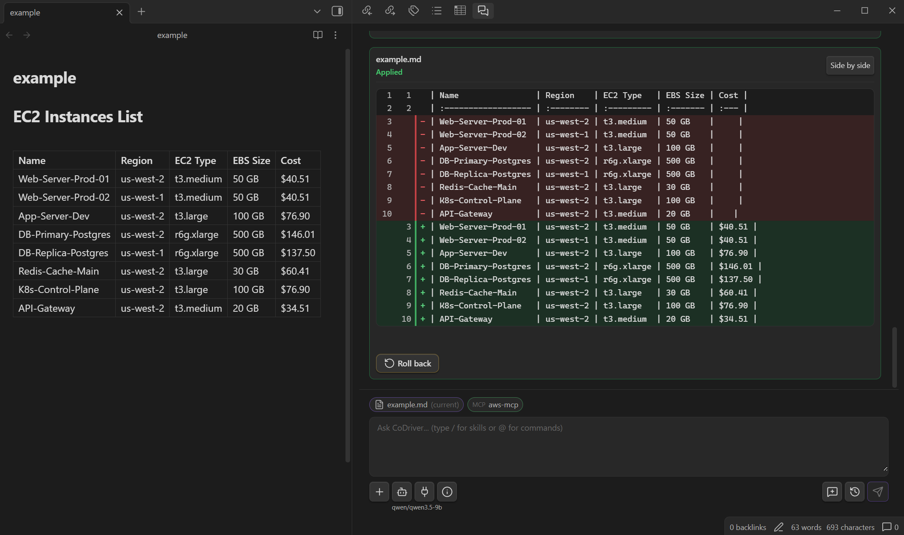

# CoDriver

Chat with your Obsidian vault without leaving Obsidian.

CoDriver puts your preferred language models in the right sidebar. Create, improve, and organize notes without giving up control over changes.

## What you can do

- Create notes, append content, update text and properties, move files, and send notes to trash.
- Review note patches as a unified diff or side-by-side comparison, then accept, reject, or roll back an applied patch.
- Connect OpenAI-compatible providers, Gemini, or Anthropic and switch models from the chat composer.
- See every vault tool call and control automatic execution per tool.

## Add your first provider

1. Open **Settings -> CoDriver Settings -> Providers**.
2. Click **Add model** under **LLM providers**.
3. Choose the **Provider type**, enter a name, and check the endpoint.
4. Enter the **API key** directly. The field starts masked; use the eye button to show or hide it. Keys stay in Obsidian secret storage. Test connection uses the current input without saving it.
5. Click **Test connection** to load available models.
6. Choose the **Default model** and click **Save**.

| Provider type | Endpoint | Notes |
| --- | --- | --- |
| OpenAI | Your provider's OpenAI-compatible `/v1` endpoint | Hosted services and local servers are supported. |
| Gemini | `https://generativelanguage.googleapis.com` | The API version defaults to `v1beta`. Tool mode selects Google Search or Custom tools; Google Search mode does not expose MCP tools to the model. |
| Anthropic | `https://api.anthropic.com` | Uses the native Claude Messages API. The endpoint is fixed. |

If the test fails, check the endpoint, API key, account access, and local server status. OpenAI-compatible endpoints commonly end in `/v1`.

## Work with your vault

CoDriver works with your vault through its built-in MCP server. Its configurable tools use the native Obsidian API to search, read, create, update, move, and trash vault files.

*After applying a patch, **Roll back** can restore the previous version while its review state remains in the live session. If the note has changed again, CoDriver refuses an unsafe rollback.*

## More features

- **Attachments and audio:** Add supported files to the conversation and transcribe audio.
- **Skills and commands:** Reuse instructions, local references, and prompt templates.
- **MCP:** Connect external HTTP tools, or stdio tools on supported desktop runtimes. HTTP supports None, Bearer token, or Custom headers authentication with one credential field stored in Obsidian secret storage (Obsidian 1.11.4 or later). The stored value is only the bearer token or custom header text; authentication metadata stays in plugin settings. Existing HTTP headers migrate automatically after verified storage writes; failed migrations preserve the original values and block the affected HTTP connection until retry or repair. Clearing credentials unlinks the reference without deleting shared secrets. Historical backups are not cleaned by migration.
- **Stdio configuration:** Command contains one program with arguments, not a shell script. Command and Environment remain ordinary plugin settings in `data.json`, including any credentials entered there. Environment accepts one `KEY=value` per line.
- **MCP limits:** Max tools warns before an oversized catalog is sent to the model; Continue sends all available tools for that request. Max calls warns before another automatic tool call. Continue for session skips further Max calls warnings for the current request. Output chars lets you review a large tool result before sending it to the model. Earlier eligible results remain available during the live session; Maximum context size reviews the combined request.
- **Local sessions:** Keep chat history on your device without saving attachment contents, transcripts, or tool results in it.

## Safety and privacy

- Active-note content is never injected automatically.
- Provider keys use Obsidian secret storage. Existing secret names remain unchanged; newly created entries use `codriver-provider-<unique-id>`. Saving an unchanged key keeps its reference; replacing it creates a verified new entry. Emptying the field and saving unlinks the key without deleting a shared secret. Cancel discards edits.
- Old provider keys stored directly in settings migrate automatically after verified SecretStorage writes. If migration fails or credentials conflict, the original settings file is preserved and settings saves are blocked until retry or explicit repair in the provider form. No plaintext fallback is used. Historical backups are not cleaned by migration.
- Provider and MCP server deletion confirmations offer **Remove secret: <name>**, checked by default when a secret is configured. Uncheck it to keep the secret. Cleanup uses the runtime deletion method when available, otherwise clears the saved value; an empty entry may remain in Keychain. Secrets referenced by another CoDriver connection are kept. Other plugins' references cannot be detected. Cancel preserves both the connection and secret. Cleanup failure after connection deletion offers a separate retry.
- With several conflicting legacy keys, **Keep prepared change** lets you review the next provider before committing all repairs. Cancel discards the current prepared repair; restart discards all repairs held in memory.
- Proposed edits are revalidated before application or rollback.
- External MCP servers validate their tools' arguments against the discovered input schema. CoDriver preserves arguments without coercion and checks bounded JSON structure, request-bound catalogs, and tool permissions before dispatch. Built-in CoDriver Vault tools retain local schema validation and mutation review.
- Diagnostics exclude note content, prompts, provider responses, tool data, transcripts, and secrets.

Your selected provider still receives the context required for the current request. Review that provider's privacy and retention terms before sending sensitive material.

## Installation

1. Open the [latest CoDriver release](https://github.com/NikChallenger/codriver/releases/latest).
2. Download [`main.js`](https://github.com/NikChallenger/codriver/releases/latest/download/main.js), [`manifest.json`](https://github.com/NikChallenger/codriver/releases/latest/download/manifest.json), and [`styles.css`](https://github.com/NikChallenger/codriver/releases/latest/download/styles.css).
3. Copy them into `.obsidian/plugins/codriver/` inside your vault.
4. Open **Settings -> Community plugins**, turn off **Restricted mode**, and enable **CoDriver**.

To update CoDriver, download the latest versions of the same three files, replace the installed copies, and reload Obsidian.

The chat shows a compact release notes banner on first installation and after a newer version is installed. **What's new** opens the local notes window; **Dismiss** hides the banner. Either action remembers the version in local plugin settings, so the banner stays hidden after reopening the chat or restarting the plugin. The notes window never opens automatically and requires no network access.

The public GitHub repository contains the reviewed source snapshot and generated release artifacts for each public version. Its root `build.mjs` rebuilds `main.js` without registry dependencies, and the committed bundle must match that build exactly. Private release-control instructions, internal automation, and tests are not included in the public snapshot.

The build embeds only `docs/releases/<manifest version>.md` in `main.js`. Release authors update that file with the matching version metadata; the build rejects missing, empty, mismatched, oversized, or non-ASCII notes. Supported notes formatting is paragraphs, level-two/three headings, and dash lists; other markup is displayed as plain text. Links and images in these notes do not load external resources.

GitHub's automatically generated source archives are source snapshots, not installable CoDriver packages. Install CoDriver using the three assets attached to a matching GitHub release.

## Requirements

- Obsidian `1.5.0` or newer.
- A supported provider account or server.
- Desktop Obsidian with Node subprocess support for stdio MCP servers.

CoDriver works inside Obsidian. It is not a background automation agent or a CLI coding tool.

> [!WARNING]
> CoDriver is still evolving. For peace of mind, try it in a test vault first and keep regular backups of important notes.

## License

CoDriver is available under the [MIT License](LICENSE). See [Third-Party Notices](THIRD_PARTY_NOTICES.md) for vendored dependencies and their licenses.
